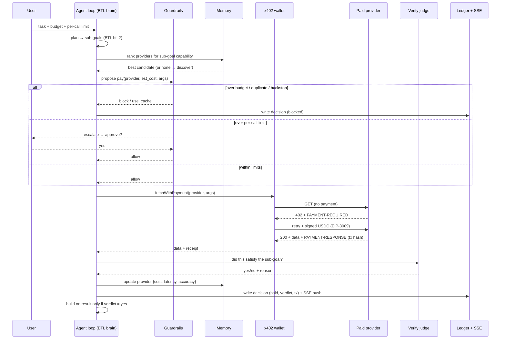

# 02 — System Architecture

## Three layers, one rule

```
        ┌───────────────────────────────────────────────────────────────┐
        │                         apps/agent                             │
        │                                                                │
        │   BRAIN                 CONSCIENCE                 HANDS        │
        │  ┌────────────┐        ┌──────────────┐         ┌───────────┐  │
        │  │ BTL Runtime│  tool  │  Guardrails   │  allow  │ x402 client│ │
        │  │  (LLM via  │ ─call─▶│ (deterministic│ ──────▶ │  + viem    │ │
        │  │  openai SDK)│       │  pure funcs)  │         │  wallet    │ │
        │  └─────▲──────┘        └──────┬───────┘         └─────┬─────┘  │
        │        │ verified result      │ block/escalate        │ USDC   │
        │        │                       │                       │        │
        │  ┌─────┴───────┐       ┌──────▼───────┐         ┌──────▼─────┐ │
        │  │ Verify judge │       │  Memory       │         │  Ledger    │ │
        │  │ (cheap LLM)  │       │ (providers)   │         │ (decisions)│ │
        │  └──────────────┘       └───────────────┘         └────────────┘ │
        │                             SQLite (Drizzle)                    │
        └──────────────┬────────────────────────────────────┬───────────┘
                       │ SSE (live decisions)                │ x402 HTTP
                       ▼                                     ▼
                 ┌───────────┐                    ┌──────────────────────┐
                 │ apps/web   │                    │ paid endpoints        │
                 │ dashboard  │                    │ apps/mock-provider    │
                 │ (Next.js)  │                    │ + real (CoinGecko...) │
                 └───────────┘                    └──────────────────────┘
```

**Rule:** the Brain proposes, the Conscience disposes, the Hands sign. The LLM never touches the key.

## Request flow (one sub-goal, cold run)



## Why cold run vs warm run differs (the demo)

- **Cold run:** memory empty → agent explores, may pay a bad provider (caught by Verify, dropped), hits a duplicate guard, finishes at higher cost.
- **Warm run:** memory seeded from run 1 → agent skips the known-bad provider, goes straight to the best-scored ones, fewer calls, ~half the spend. The dashboard shows **"saved by memory."**

## Monorepo layout

```
mizan/
├─ pnpm-workspace.yaml
├─ package.json                # root scripts (db:push, db:seed, dev orchestration)
├─ tsconfig.base.json
├─ .env.example
├─ CLAUDE.md
├─ docs/
├─ packages/
│  └─ shared/
│     ├─ src/types.ts          # RunConfig, SubGoal, Capability, Decision, ProviderStat, GuardrailResult
│     ├─ src/usdc.ts           # atomic-unit helpers (6 decimals), formatting
│     ├─ src/catalog.ts        # CATALOG: single source of truth for provider prices (agent + mock share it)
│     ├─ src/demo.ts           # pinned demo task string
│     └─ src/db/
│        ├─ schema.ts          # drizzle schema (providers, runs, decisions)
│        └─ seed.ts            # pnpm db:seed — good + bad providers for the warm-run demo
│  # drizzle.config.ts lives at the repo root (required by drizzle-kit push)
└─ apps/
   ├─ agent/
   │  ├─ src/index.ts          # express app: POST /run, GET /run/:id/stream (SSE)
   │  ├─ src/loop.ts           # the plan→act→verify orchestration
   │  ├─ src/btl.ts            # BTL Runtime client (reasoning + verify judge)
   │  ├─ src/tools.ts          # tool schemas exposed to the LLM
   │  ├─ src/pay/x402.ts       # wallet + x402 client (the ONLY place the key lives)
   │  ├─ src/guardrails/       # one pure function per guardrail + composite gate
   │  ├─ src/memory.ts         # provider ranking + updates
   │  ├─ src/ledger.ts         # write decisions + SSE emitter
   │  └─ test/guardrails.test.ts
   ├─ mock-provider/
   │  └─ src/index.ts          # @x402/express paid endpoints on Base Sepolia
   └─ web/
      ├─ app/page.tsx          # dashboard
      ├─ app/api/...           # proxies to agent if needed
      └─ components/           # LedgerFeed, SpendMeter, ProviderTable, RunControls
```

## Data flow summary

- **Config in:** `POST /run { task, budgetUsd, perCallLimitUsd }` → returns `runId`.
- **Live out:** `GET /run/:runId/stream` (SSE) emits `status`, `decision`, `decision:update`, `escalation`, `done` (replays persisted rows on connect). `POST /run/:runId/approve { decisionId, approve }` resolves an escalation. `GET /providers` feeds the ProviderTable (no SSE channel for memory). All SSE money fields are integer atomic USDC.
- **State:** SQLite. `providers` persists across runs (the learning). `runs` + `decisions` are the ledger.
- **Money:** only `apps/agent/src/pay/x402.ts` imports the private key and can sign. Everything else calls a typed `pay(request)` that internally runs the guardrail gate first.

## Security boundaries

- Private key: only in `apps/agent` process env, only read inside `pay/x402.ts`. Never logged, never returned in an API response, never placed in an LLM message or tool description.
- The dashboard is read-only over SSE + a couple of control endpoints (start run, approve escalation). It never sees the key.
- Escalation approvals are signed off by the user in the UI and gated server-side; the model cannot self-approve.
